# Embeded-Agent 嵌入式智能交互 Agent 系统

## 摘要

本项目设计并实现了一个面向嵌入式场景的智能交互 Agent 系统，核心目标是在用户长时间使用电脑的过程中，通过多模态感知持续监测用户状态，在适当的时机主动提供健康关怀和提醒。系统以桌面宠物为呈现形式，整合视觉感知、语音交互和环境感知三条链路，由大语言模型承担语义决策，Python 运行时负责精确的规则控制和数据统计。系统内置三层记忆机制，能够在学习用户行为偏好的基础上逐步优化关怀策略。

---

## 1 背景与目标

### 1.1 问题背景

在日常办公和学习场景中，用户长时间面对屏幕时，往往沉浸于手头事务而忽略自身的疲劳状态、不良坐姿和环境变化。这种忽视短期来看影响工作效率，长期则可能损害身心健康。传统的解决方案——如定时弹窗或外部设备——交互方式单一、缺乏对用户个体差异的感知，难以在合适的时机以恰当的方式介入。

与此同时，边缘计算平台的算力持续提升，为在本地设备上运行多模态感知模型和轻量级 Agent 提供了可行性。综合以上背景，我们希望构建一个能够感知、理解并主动关怀用户的嵌入式智能 Agent。

### 1.2 项目目标

本项目的核心目标有三个层面：

**感知能力**：整合视觉（表情、疲劳、姿态）、语音（唤醒、识别、合成）和环境（温度、湿度、光照、噪声）三个感知域，构建持续的用户状态监测能力。

**决策能力**：在精确规则与大语言模型之间建立清晰的分工——前者控制关怀触发的确定性条件，后者负责语义理解和文案生成，使关怀既及时又自然。

**适应能力**：通过长期记忆机制持续学习用户的个人偏好和工作习惯，使系统随使用时间的增长而越发贴合个体特点。

---

## 2 系统能力

系统具备以下核心能力：

- **多模态感知**：视觉、语音、行为和环境四个感知域并行采集数据，独立向决策层输出标准化事件。
- **主动关怀**：无需用户主动触发，系统在检测到疲劳、负面情绪、不良姿态、行为分心和环境异常时，自主判断介入时机并主动提醒。
- **语音交互**：支持唤醒词唤醒后的人机语音对话，用户可以通过语音指令控制计时器、切换模式或发起闲聊。
- **个性化适应**：长期记忆机制持续学习用户偏好，使关怀文案和策略逐步贴合个人特点。

---

## 3 硬件平台与部署拓扑

系统运行在 **华为 Atlas 200I DK A2** 开发板（Ascend 310B1 NPU）上，通过 **USB 拓展坞** 汇聚各类外设，形成「一板多感」的桌面感知节点。Atlas 板负责视觉推理、语音编排与 Agent 决策；ESP32 负责环境传感采集；PC 端桌面宠物负责 UI 呈现（经 USB 串口与板端通信）。

### 3.1 硬件清单

| 类别 | 设备 | 作用 | 连接方式 |
|------|------|------|----------|
| 计算平台 | Atlas 200I DK A2 | NPU 加速推理、Agent 运行时、语音编排 | — |
| 视频输入 | Logitech C920 摄像头 | 人脸/行为/姿态画面采集；**用户说话录音**（内置麦克风） | USB 拓展坞 |
| 音频 I/O | USB 免驱声卡（UAC 盒子） | **唤醒词监听**（盒子麦克风）+ **TTS 播报**（盒子扬声器） | USB 拓展坞 |
| 环境传感 | ESP32 + DHT22 / BH1750FVI / MAX4466 | 温湿度、光照、噪声采集后经串口上报 | USB 串口（`/dev/ttyUSB0`，115200） |
| 汇聚 | USB 拓展坞 | 同时接入 C920、UAC 声卡、ESP32 等 USB 设备 | Atlas USB 口 |
| 呈现 | PC 桌面宠物 | 表情动画与文字展示 | USB 串口 JSON 协议 |

### 3.2 部署拓扑

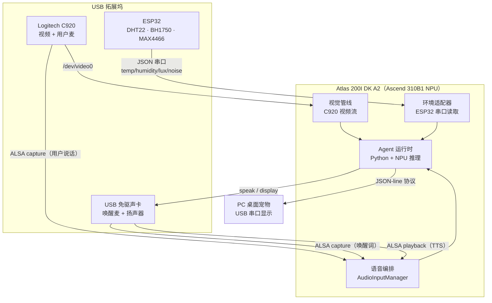

### 3.3 音频路由策略

系统按**设备名称**（而非 card 编号）自动匹配音频设备，避免 USB 插拔或重启后路由错乱：

| 音频角色 | 默认设备 | 说明 |
|----------|----------|------|
| 用户说话录音 | C920 内置麦 | 唤醒后 VAD 停录，整段送 ASR |
| 唤醒词监听 | UAC 盒子麦 | Sherpa-ONNX 本地 KWS，持续监听 |
| TTS 播报 | UAC 盒子扬声器 | 唤醒应答、Agent 回复、自主提醒统一排队 |

### 3.4 ESP32 环境传感器

ESP32 作为环境采集节点，通过 GPIO / I2C / ADC 读取三路外设，经 USB 虚拟串口周期性上报 JSON；Atlas 端 `Esp32EnvironmentAdapter` 解析后注入决策层。

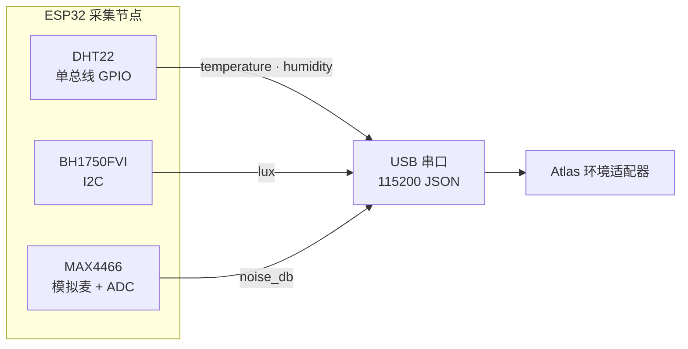

#### 传感器模组

| 维度 | 模组 | 接口 | 量程 / 精度（典型） | 说明 |
|------|------|------|---------------------|------|
| 温度 | **DHT22** | 单总线 GPIO | −40 ~ 80°C，±0.5°C | 与湿度共用同一模组 |
| 湿度 | **DHT22** | 单总线 GPIO | 0 ~ 100% RH，±2% RH | 采样间隔建议 ≥ 2 s |
| 光照 | **BH1750FVI** | I2C | 1 ~ 65535 lux，高分辨率模式 | 环境照度，单位 lux |
| 噪声 | **MAX4466** | 模拟输出 → ESP32 ADC | 板端标定后映射为 dB | 驻极体麦 + 可调增益放大，采样环境声压 |

#### 上报字段与关怀阈值

| 维度 | JSON 字段 | Agent 舒适区间 |
|------|-----------|----------------|
| 温度 | `temperature` / `temperature_c` | 18–26°C |
| 湿度 | `humidity` / `humidity_pct` | 40–60% |
| 光照 | `lux` / `light_lux` | 300–600 lux |
| 噪声 | `noise_db` | < 45 dB |

典型上报示例：

```json
{"temperature": 24.5, "humidity": 52.0, "lux": 420, "noise_db": 38}
```

---

## 4 系统架构

### 4.1 整体架构

系统采用分层架构，各层职责边界清晰，自底向上依次为感知层、事件层、决策层、记忆层和动作层。

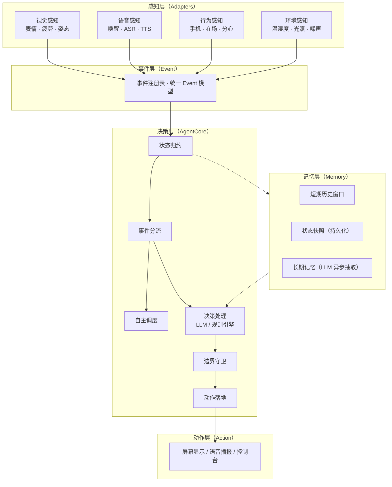

### 4.2 各层职责

**感知层**负责与硬件和外部服务交互，将原始数据转换为标准化事件格式。视觉、语音、行为、环境四个感知域各自独立运行，通过统一的事件接口向上游输出。这种设计使感知逻辑与核心决策逻辑完全解耦——更换底层传感器或算法不会影响上层逻辑。

**事件层**定义了系统中所有事件类型的注册表。每条事件包含类型、时间戳和载荷三要素。无论摄像头检测到表情变化、串口上传温度读数，还是用户发起计时器指令，均以这一统一格式流转。

**决策层**是系统的核心，包含事件路由、状态归约、自主调度、决策处理、边界守卫和动作落地六个子模块。

**记忆层**为决策提供用户相关的上下文信息，包括短期的运行时数据、中期的状态快照和长期的个性化记忆。

**动作层**将决策结果落实为用户可见的响应，通过屏幕显示、语音播报或控制台输出三种形式与用户交互。

---

## 5 感知模型与算法

系统在识别任务上采用「**边缘 NPU 优先、云端补语义**」的策略：视觉检测与情绪分类在 Atlas NPU 本地运行；语音唤醒与可选离线 TTS 在板端 CPU 运行；ASR、TTS（默认）与 LLM 决策走云端 API。

### 5.1 模型总览

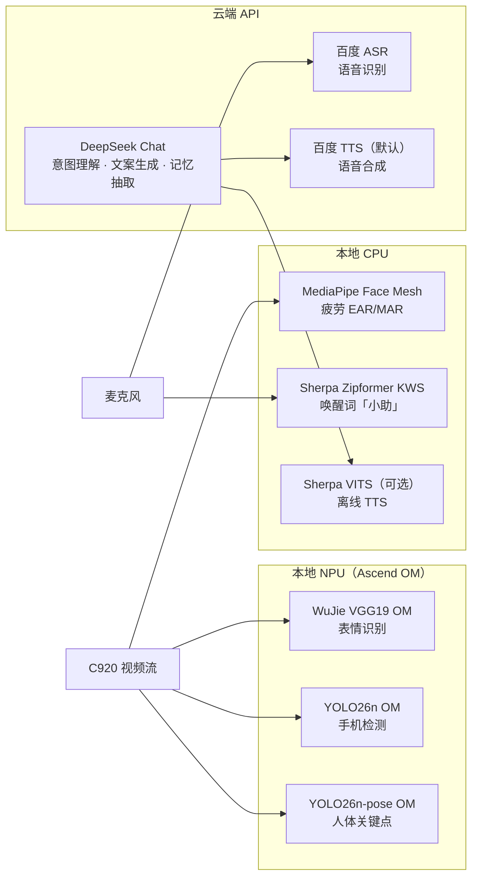

### 5.2 视觉识别模型

| 感知任务 | 默认模型 / 算法 | 推理后端 | 部署位置 | 输出事件 |
|----------|----------------|----------|----------|----------|
| 表情识别 | WuJie VGG19（FER2013 训练，`.om`） | `wujie-om` | Ascend NPU | `user_emotion_updated` |
| 疲劳检测 | MediaPipe Face Mesh + EAR/MAR/PERCLOS | `mediapipe` | CPU | `user_fatigue_updated` |
| 手机检测 | YOLO26n（COCO cls=67 手机类） | `om` / `pt` | NPU / CPU 回退 | `user_attention_updated` |
| 人体关键点 | YOLO26n-pose（COCO 17 点） | `om` / `pt` | NPU / CPU 回退 | 在场 / 姿态 / 活动 |
| 姿态推断 | YOLO26-pose 关键点 + 几何规则 | 规则引擎 | CPU | `user_posture_updated` |

**表情识别备选后端**（可通过 `--emotion-backend` 切换）：

| 后端 | 模型 | 适用场景 |
|------|------|----------|
| `wujie-om`（默认） | `wujie_vgg19_static.om` | Atlas NPU 生产部署 |
| `wujie-vgg19` | WuJie VGG19 PyTorch 权重 | 开发机 GPU/CPU 调试 |
| `deepface` | DeepFace（默认 `VGG-Face`） | 无 NPU 时的通用方案 |
| `raf` | RAF-ResNet 权重 | 需额外提供 checkpoint |
| `none` | — | 仅跑疲劳，跳过表情 |

**行为检测管线**：C920 采集 BGR 帧 → 共用 `letterbox` 预处理 → YOLO26n 检手机 + YOLO26n-pose 检人体 → 手腕邻近 / 上半区手机 / 低头辅助等多信号 OR 判定 → 时间窗口统计后触发分心关怀。

### 5.3 语音识别与合成模型

| 环节 | 默认方案 | 模型 / 服务 | 部署 | 说明 |
|------|----------|-------------|------|------|
| 唤醒词检测 | Sherpa-ONNX KWS | Zipformer（WenetSpeech 3.3M） | 本地 CPU | 固定词「小助」，无网络依赖 |
| 唤醒即时应答 | 预加载 WAV | — | 本地 | 「我在，请说。」与开麦并行 |
| 语音识别（ASR） | 百度 ASR | 云端短语音 API | 云端 | VAD 说完停录后整段上传 |
| 语音合成（TTS） | 百度 TTS（默认） | 云端 TTS API | 云端 | 流式 LLM + 逐句 TTS，首句更快出声 |
| 语音合成（备选） | Sherpa-ONNX VITS | `vits-icefall-zh-aishell3` | 本地 CPU | `--tts-backend sherpa-onnx` |

唤醒词备选：`energy`（音量触发，非固定词）、`porcupine`、`mock`（测试）。

### 5.4 决策与记忆模型

| 任务 | 模型 | 说明 |
|------|------|------|
| 语音意图理解 | DeepSeek Chat（`deepseek-chat`） | 单次 LLM 理解 + 回复生成 |
| 自主关怀文案 | DeepSeek Chat | 疲劳 / 情绪 / 环境 / 分心各独立 prompt |
| 长期记忆抽取 | DeepSeek Chat | 语音交互后异步后台抽取偏好 |

`sensor_status_report`（传感器数值播报）为确定性模板，不调用 LLM。

---

## 6 核心设计

### 6.1 事件驱动架构

系统以事件作为各模块间信息传递的媒介。外部感知产生事件，事件驱动状态更新，状态变化触发决策，决策结果落地为动作。这一机制天然支持多路并发的感知输入——摄像头、麦克风和串口可以独立采集数据，无需相互协调，数据通过事件队列汇入调度中枢后统一处理。

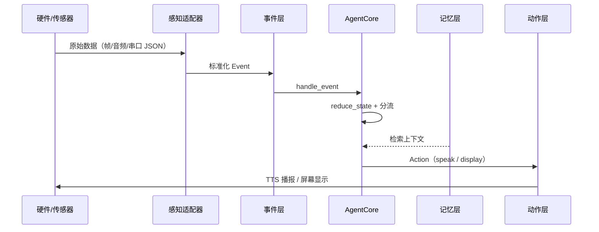

### 6.2 确定性逻辑与大语言模型分工

我们在设计中发现，系统中的决策存在两类性质截然不同的判断：一类是信号窗口统计、阈值比对、冷却计时等规则明确的操作，适合由程序代码精确控制；另一类是理解用户意图、生成符合个人风格的文案、根据上下文选择最优行动等需要语义理解的决策，适合交给大语言模型处理。

基于这一认识，我们将决策链路设计为双层结构：

**Python 层**负责信号统计、阈值判断、冷却管理、路由分流和边界守卫。这些逻辑完全确定性、可预测、可测试。关怀触发的核心条件——持续多久算疲劳、占比多少算分心——由 Python 精确把控，避免因模型随机性导致体验忽冷忽热。

**大语言模型层**在 Python 层筛选出的候选项基础上，负责意图理解、文案生成和场景判断。两层之间有清晰的职责边界：Python 层决定"是否需要关怀"，大语言模型层决定"如何关怀"。

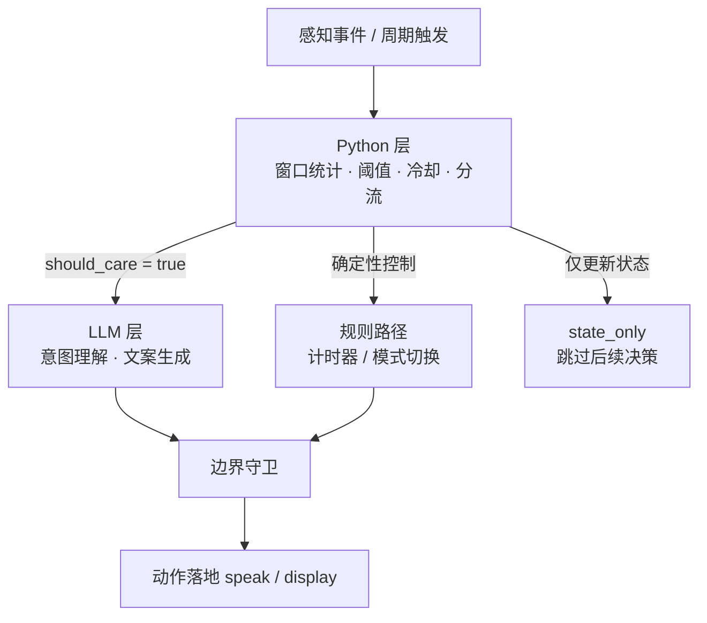

### 6.3 自主调度机制

系统内置时间驱动的自主调度器，在后台持续运行四个周期性关怀任务：

| 任务 | 周期 | 优先级 | 说明 |
|------|------|--------|------|
| 行为分心检查 | 20 秒 | 最高 | 用户在场且专注模式中 |
| 健康关怀检查 | 30 秒 | 高 | 用户在场 |
| 环境关怀检查 | 60 秒 | 中 | 始终运行 |
| 传感器播报 | 5 分钟 | 低 | 始终运行 |

调度器以真实流逝时间驱动倒计时，而非按固定间隔触发。当高优先级任务（如语音交互）正在执行时，低优先级任务的倒计时冻结，执行完成后从冻结处恢复。这确保了语音对话等高优先级交互不被周期性关怀检查打断，同时也避免了低优先级任务因频繁被打断而永远无法执行。

```mermaid
gantt
    title 自主调度优先级示意
    dateFormat X
    axisFormat %s

    section 高优先级
    语音交互（冻结低优先级倒计时） :active, 0, 8

    section 周期性任务
    行为分心检查（20s） : 0, 20
    健康关怀检查（30s） : 0, 30
    环境关怀检查（60s） : 0, 60
```

### 6.4 事件分流

进入决策层的事件首先经过分流模块，根据类型被路由到七条处理路径之一：

- **语音理解**：用户语音识别结果进入大语言模型，理解意图并生成回复
- **行为分心检查**：调度器周期性触发，检查玩手机行为是否持续
- **健康关怀检查**：调度器周期性触发，检查疲劳、情绪和姿态
- **环境关怀检查**：调度器周期性触发，检查环境参数是否异常
- **传感器播报**：调度器周期性触发，直接播报当前传感器数值
- **规则决策**：专注开始/停止等确定性控制直接执行，无需大语言模型介入
- **仅状态更新**：传感器原始数据更新内部状态，不触发主动交互

这种七路分流设计使每类事件得到针对性的处理策略：需要语义理解的走大语言模型路径，需要周期性检查的走调度器路径，确定性控制走规则路径，高频状态更新走轻量路径。

### 6.5 边界守卫

即使关怀逻辑判定需要提醒，也必须通过边界守卫的检查才能真正执行。守卫负责三项硬约束：

- **防刷屏**：同一类提醒在冷却期内不重复出现
- **防打断**：语音播报期间不插入新提醒，用户离开后暂停主动关怀
- **用户在场检查**：用户不在场时，不触发任何需要响应的提醒

守卫是系统中唯一的"一票否决"环节，其逻辑完全确定性，不涉及任何语义判断。

---

## 7 记忆体系

### 7.1 设计动机

在健康关怀场景中，仅知道用户"当前"的疲劳程度是不够的——要给出有价值的关怀，还需要了解用户的习惯和个性。例如，同样是检测到疲劳，对于一个习惯长时间专注的用户，系统可能建议短暂休息；对于一个讨厌被打断的用户，则应选择更委婉的方式。这些信息不可能每次交互时临时生成，而需要在长期使用中持续积累。

基于这一需求，我们设计了三层记忆体系：短期历史窗口处理实时统计，中期状态快照保证运行连续性，长期记忆提供个性化上下文。

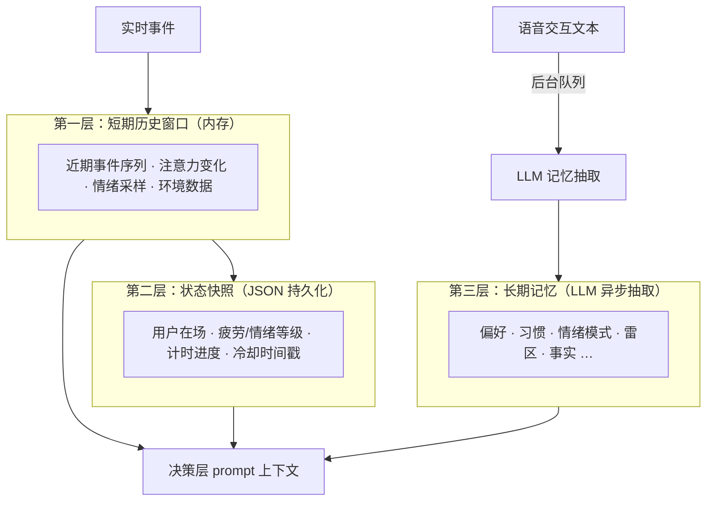

### 7.2 第一层：短期历史窗口

内存中的滚动数据窗口，记录最近一段时间内的行为轨迹，供统计模块实时查询。窗口中保存的数据包括：近期事件序列、近期待处理的消息记录、注意力变化序列、情绪采样序列和环境数据变化。

以注意力信号为例，窗口中维护的不只是"当前是否专注"的瞬时值，还包括"之前的状态是什么""上一次状态变化发生在什么时候""最近一段时间内各状态各出现了多少次"等统计信息。疲劳检测和情绪检测都依赖这些窗口统计数据——单帧的疲劳程度高低没有意义，只有持续一定时间的疲劳趋势才值得触发关怀。窗口大小固定，超出上限后自动丢弃最旧的数据，确保内存占用可控。

### 7.3 第二层：状态快照

状态快照记录当前时刻的完整系统状态，包括用户在场状态、注意力、行为、情绪、疲劳等级、专注计时进度、环境读数和各类提醒的冷却时间戳。这些状态以 JSON 格式持久化到文件系统，系统重启后可恢复至接近重启前的运行上下文。

### 7.4 第三层：长期记忆

长期记忆是从用户日常言谈中异步提取的个性化信息。区别于用户主动填写的偏好资料（如"我每天工作8小时"），长期记忆是系统通过对话"观察"出来的隐含信息（如"用户在讨论加班时语气疲惫，可能近期工作压力较大"）。

记忆提取流程如下：用户完成一次语音交互后，对话文本被放入后台队列；独立的提取线程调用大语言模型，从文本中归纳出用户的行为偏好、情绪模式、工作习惯等结构化信息；提取结果经过合并去重后写入记忆库。在后续关怀决策中，系统检索与当前场景最相关的记忆条目作为上下文，使生成的关怀文案更贴合个人特点。

系统维护九类记忆：

| 类别 | 含义 |
|------|------|
| 偏好 | 对回答风格、语气、用词的习惯性倾向 |
| 爱好 | 工作之外的兴趣活动 |
| 习惯 | 日常行为规律，如作息习惯、工作专注模式 |
| 情绪模式 | 在特定场景下的情绪反应规律 |
| 工作风格 | 处理任务的方式和偏好 |
| 互动风格 | 对交互方式的口味，如喜欢简洁或偏好闲聊 |
| 关怀策略 | 有效的安慰和鼓励方式 |
| 雷区 | 不希望的交互方式，如过度提醒 |
| 事实 | 其他长期有效的个人信息 |

检索策略方面，系统通过差异化打分机制为不同场景选择最相关的记忆。同时引入近期使用降权策略：刚被使用过的记忆在短时间窗口内降低被再次选中的概率，避免同一记忆被反复引用而导致对话单调。

---

## 8 核心功能

### 8.1 健康关怀

健康关怀模块每 30 秒检查一次，监测疲劳、情绪和姿态三个维度。

#### 疲劳检测

本模块采用**时间窗口统计**策略，综合多个维度的信号来判断疲劳是否真实持续。

系统从两个生理指标提取疲劳信号：**眼部指标**基于 MediaPipe Face Mesh 提取的关键点，计算眼部纵横比（EAR）衡量眨眼频率。疲劳状态下眨眼频率会显著升高，当窗口内平均 EAR 低于正常值且持续一定时间时，视为疲劳信号增强。**嘴部指标**基于嘴部纵横比（MAR）检测张嘴行为。持续张嘴（打哈欠）是疲劳的典型特征，短时间内的张嘴频率作为辅助判断。此外，**头部角度**也作为参考信号——头部持续下垂意味着注意力涣散或困倦。

触发条件综合以下四项，满足任一项即判定为疲劳触发：

- 高疲劳等级持续超过 2 分钟
- 中度疲劳等级持续超过 3 分钟
- 高疲劳等级在窗口内占比超过 50%
- 当前中度疲劳且峰值置信度较高

#### 情绪检测

情绪检测使用 WuJie VGG19 OM 模型（默认）识别人脸 crop 中的情绪类别，对焦虑、沮丧、愤怒等负面情绪较为敏感。负面情绪往往持续时间较短但情绪强度较高，因此触发逻辑同时考察时间和强度两个维度：

- 负面情绪连续出现超过 30 秒
- 负面情绪在窗口内占比超过 40%
- 检测到极端负面情绪（如强烈焦虑、愤怒），不要求持续时间

#### 姿态检测

姿态检测通过 YOLO26n-pose 输出的 COCO 17 人体关键点，结合几何规则推断 posture（sitting / standing / leaning / lying）。当检测到 leaning 等不良姿态且持续一定时间后，触发坐姿调整提醒。

#### 关怀文案生成

三类触发信号进入大语言模型后，模型综合考虑当前状态（哪种信号触发、严重程度如何）、用户记忆（用户的互动风格、是否偏好简短提醒、有什么雷区）和对话上下文（之前的关怀话题是什么），生成一段自然流畅的关怀文案。最终文案经过质量校验后由语音合成输出。

### 8.2 行为分心检测

行为分心检测每 20 秒运行一次，重点判断用户是否在长时间使用手机而忽略手头事务。

与单帧分类不同，本模块采用**时间窗口统计**策略，综合以下四个条件判断分心行为：

- 过去 60 秒内"使用手机"的帧数不少于 6 帧
- 其中 YOLO26n 直接识别到手机的帧数不少于 3 帧
- "使用手机"的帧数占总帧数的比例不低于 40%
- 最近一次"使用手机"距当前时间不超过 20 秒

四个条件同时满足，才判定为持续分心。单一条件达成（如偶发拿起手机看时间）不会触发提醒。

这种设计有效规避了两类问题：偶发误检（如转头时余光扫到手机）和持续漏检（如手臂遮挡导致某帧未识别到）。真实用户行为具有时间连续性，窗口统计比单帧判决更接近用户的实际状态。

触发后，系统判断用户当前是否处于专注计时模式。若在专注模式中，分心提醒的紧迫程度更高；若不在专注模式，则以温和的提醒方式询问是否需要帮助集中注意力。

### 8.3 环境关怀

环境关怀模块每 60 秒检查一次室内环境参数，从 ESP32 传感器获取温度、湿度、光照和噪声四个维度的数据。

系统对每个维度设定**舒适区间**和**严重区间**，处于舒适区间内不干预，进入严重区间则根据偏离程度计算严重度，严重度越高关怀越紧迫：

| 维度 | 舒适区间 | 严重区间 | 严重度计算方式 |
|------|---------|---------|-------------|
| 温度 | 18–26°C | < 15°C 或 > 30°C | 偏离舒适区间越远，严重度越高 |
| 湿度 | 40–60% | < 30% 或 > 70% | 偏离舒适区间越远，严重度越高 |
| 噪声 | < 45 dB | > 65 dB | 越响严重度越高 |
| 光照 | 300–600 lux | < 150 lux 或 > 800 lux | 越暗或越亮严重度越高 |

每类环境异常拥有独立的冷却计时器，互不干扰——例如用户刚收到光照不足的提醒，即使下一分钟温度也出现异常，依然可以正常提醒。这一设计确保了多维度环境问题可以逐一得到关注，不会因为某一项反复提醒而压制其他项。

严重度高的环境问题（如温度超过 30°C）可以打断正在排队的其他提醒，而严重度低的问题则正常排队等待播报。

### 8.4 语音交互

语音交互是用户主动触发的对话通道，也是系统中大语言模型参与度最高的场景。

完整交互链路如下：

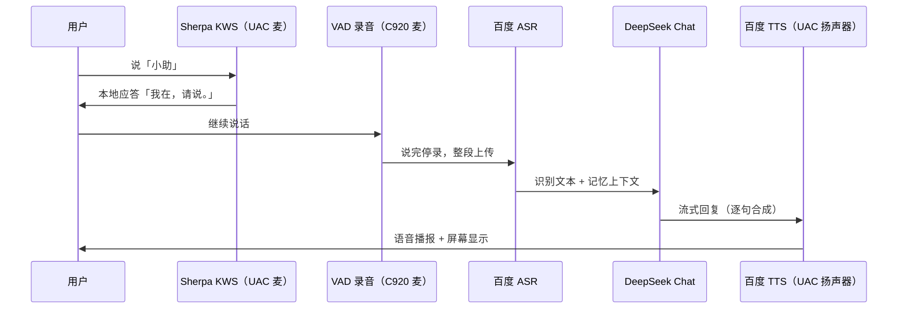

交互类型可分为三类：**信息查询**——用户问时间、天气等，系统直接查询后回答；**系统控制**——用户发起计时、切换模式等，系统执行动作并确认；**闲聊关怀**——用户表达情绪或闲聊，系统识别情感并以适当的方式回应。

唤醒词检测在本地离线运行，响应速度快且不依赖网络。语音识别和意图理解依赖云端服务，响应速度受网络延迟影响。

### 8.5 专注计时器

专注计时器以番茄工作法为参考模型，帮助用户在设定时长内保持专注。用户通过语音指令（如"开始专注 25 分钟"）启动计时，系统进入专注模式。

专注期间，系统行为与普通模式有两处关键区别：

**分心检测优先级提升**：行为分心检测的触发阈值保持不变，但一旦检测到持续玩手机，提醒的紧迫程度升至最高，并明确提示用户当前处于专注计时状态。

**疲劳关怀持续运行**：疲劳和姿态检测不受专注模式影响，持续运行。若用户在专注期间出现疲劳迹象，系统在计时结束后主动询问是否需要休息，而非在专注中途打断。

专注结束时，系统播报本次专注的总结，包括专注持续时长、期间注意力状态分布、疲劳状态等信息，帮助用户回顾和调整后续节奏。用户也可以随时语音指令提前结束专注。

### 8.6 主动提醒与被动响应

以上五类功能可以划分为两类交互模式：

**主动提醒**由系统自主发起，不需要用户触发。健康关怀、行为分心检测和环境关怀属于这一类——系统在后台持续监测，一旦条件满足立即介入。主动提醒是本系统的核心差异化能力，也是区别于传统问答式助手的关键特征。

**被动响应**由用户主动触发，唤醒词检测和语音交互属于这一类。被动响应保证了用户在需要时能够主动与系统交互，而非只能被动接受提醒。

两类模式共享同一输出通道（语音和屏幕）和同一记忆上下文，用户在主动关怀中被系统记住的偏好，同样会影响被动响应的风格。

---

## 9 感知层设计

### 9.1 视觉感知

视觉感知由 C920 摄像头采集画面，经 NPU/CPU 并行推理后输出四类事件。详细模型说明见 [§5.2 视觉识别模型](#52-视觉识别模型)。

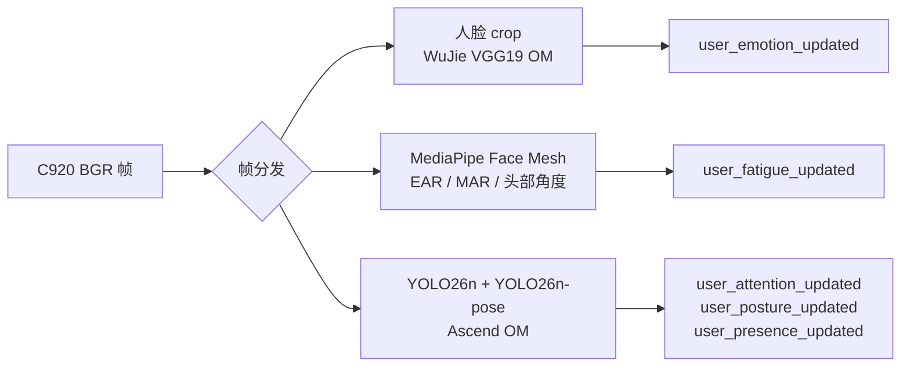

**表情识别**通过人脸 crop 送入 WuJie VGG19 OM 进行 FER2013 七类情绪分类，支持 DeepFace、RAF 等备选后端。

**疲劳感知**以 MediaPipe Face Mesh 提取的面部关键点为基础，计算眼部纵横比衡量眨眼频率、嘴部纵横比衡量张嘴程度，结合 PERCLOS 滑动窗与滞回融合综合评估疲劳程度。

**姿态感知**以 YOLO26n-pose 输出的 COCO 17 关键点为基础，通过肩-髋-膝相对位置的几何规则推断 sitting / standing / leaning / lying。

**行为感知**使用 YOLO26n 定位画面中的手机区域，结合 pose 手腕邻近、上半区高置信手机、MediaPipe 低头辅助等多信号 OR 判定，部署在 Atlas NPU 上加速推理。

### 9.2 语音感知

语音感知涵盖唤醒词检测、语音识别和语音合成三个环节。详细模型说明见 [§5.3 语音识别与合成模型](#53-语音识别与合成模型)。

**唤醒词检测**默认使用 Sherpa-ONNX Zipformer KWS 本地离线检测固定词「小助」；备选 energy 音量触发模式适用于无模型环境。

**语音识别**默认走百度 ASR 云端 API，VAD 检测到用户说完后整段上传识别。

**语音合成**默认走百度 TTS 云端 API，与 LLM 流式输出配合逐句合成；可通过 `--tts-backend sherpa-onnx` 切换为板端 Sherpa VITS 离线合成。

### 9.3 环境感知

环境感知通过 USB 串口从 ESP32 采集节点读取外设数据：**DHT22**（温湿度）、**BH1750FVI**（光照 lux）、**MAX4466**（环境噪声，ADC 标定为 dB）。支持 JSON 和传统文本两种协议格式。解析后的数据以 `temperature_humidity_updated`、`light_level_updated`、`noise_level_updated` 事件形式注入决策层，经 `state_only` 路径更新内部状态，由 60 秒周期的 `environment_care_check` 汇总后决定是否触发关怀。

---

## 10 边界守卫与仲裁机制

系统内置的边界守卫和仲裁机制确保主动关怀不会演变为干扰。

**TTS 仲裁**在语音播报期间协调麦克风资源的分配。播报开始时，系统暂停唤醒词检测以避免录音被播报声干扰；播报结束后自动恢复监听。对于在播报期间产生的关怀提醒，系统将其存入缓冲区，在当前播报完成后依次播放，避免信息丢失。

**提醒缓冲与优先级**待播提醒按生成时间排队，在当前播报结束后按序播放。紧急程度较高的提醒可在缓冲区中适当提升优先级。

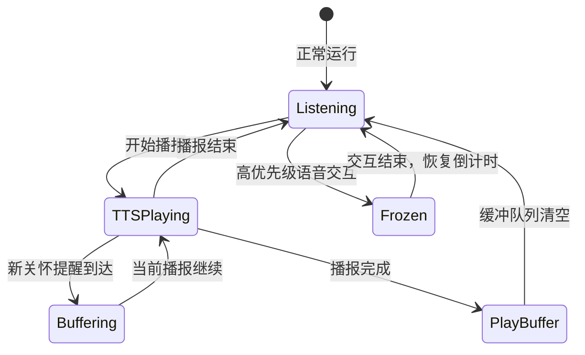

---

## 11 数据管理

运行时产生的所有数据均以 JSON 格式持久化存储：

| 数据类型 | 内容 | 用途 |
|---------|------|------|
| 运行时状态 | 用户在场状态、疲劳情绪等级、计时进度等快照 | 冷启动恢复 |
| 用户资料 | 用户主动设置或系统学习到的偏好 | 决策上下文 |
| 长期记忆 | 大语言模型抽取的个性化记忆条目 | 记忆检索 |
| 隔离实验数据 | 独立存储的实验配置和运行记录 | 开发调试 |

---

## 12 总结

本项目设计并实现了一个面向嵌入式场景的智能交互 Agent 系统，运行在 Atlas 200I DK A2 开发板上，通过 USB 拓展坞接入 C920 摄像头、UAC 声卡和 ESP32 环境采集节点（DHT22、BH1750FVI、MAX4466），构建了视觉、语音和环境三条感知链路，实现了持续的用户状态监测与主动关怀能力。

在识别层面，系统采用 WuJie VGG19 OM、YOLO26 系列、MediaPipe Face Mesh 和 Sherpa-ONNX KWS 等模型在边缘端完成表情、疲劳、行为和环境感知；语义决策与语音 ASR/TTS 则通过 DeepSeek Chat 与百度语音 API 在云端补全，形成「边缘感知 + 云端语义」的混合部署架构。

系统的核心设计在于将精确规则与大语言模型进行明确分工：Python 层负责关怀触发条件的精确把控，确保体验的确定性和稳定性；大语言模型层负责语义理解和文案生成，使关怀表达自然流畅且贴合个人特点。三层记忆体系则在两者之间建立起上下文关联，使系统能够在了解用户习惯的基础上做出更有价值的判断，而非仅依赖当前这一刻的感知数据。

在实际部署中，系统以桌面宠物为载体，以语音和屏幕为主要输出通道，将健康关怀融入日常交互的自然节奏中。随着使用时间的增长，系统对用户偏好的理解不断加深，关怀策略也随之逐步优化。展望后续，系统可进一步拓展多用户支持、个性化关怀策略的自动调优，以及与更多外部设备的联动能力。
